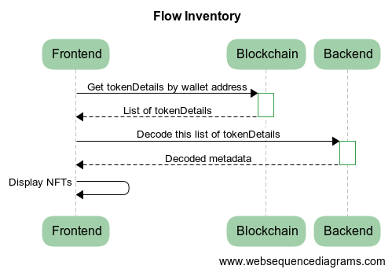
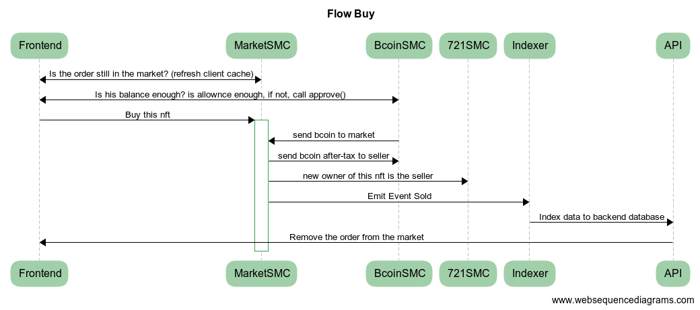

# bombcrypto_marketplace

## Architect


Principles:

- All data is read from blockchain, do not trust anything from clients.
- Indexer must have catch-up recovery mechanism, and failed-over, incase we lose connection with Blockchain, or cannot write to DB.
- All security logics relied on the Smart Contract.

##
- Deploy Frontend :

- Deploy API:

- Deploy Indexer:

- Deploy SMC: 
the private key of the deployer is in .secret file

```
cd smc
npm i 
npx truffle compile --all
```

Please review migration files one by one, and make sure adjust the correct smc address.
```
npx truffle migrate --network testnet 
```
---

## Flow Inventory


---

## Flow CreateOrder (sell)


---

## Flow Buy

Note: the smc allows a user to buy hisown order, if he willing to.

