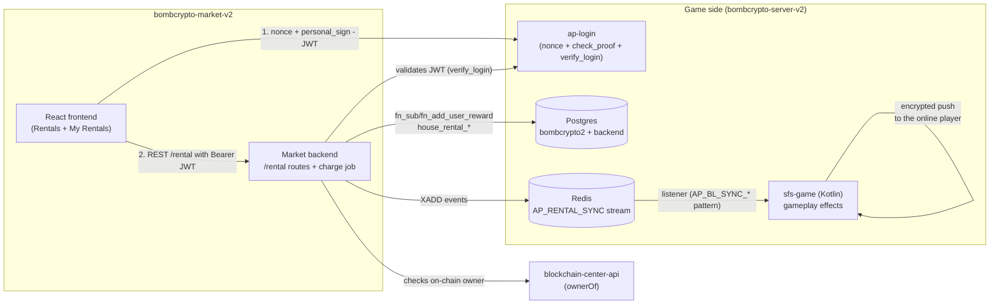
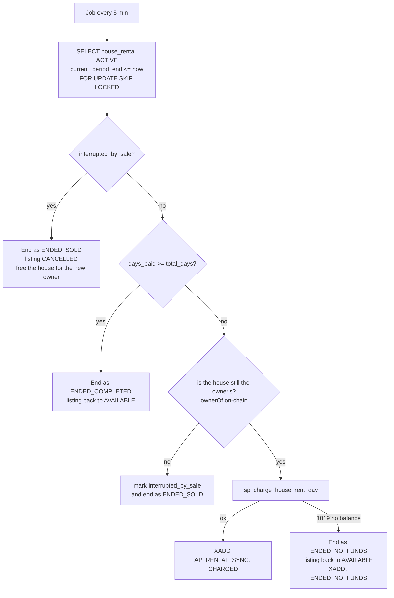
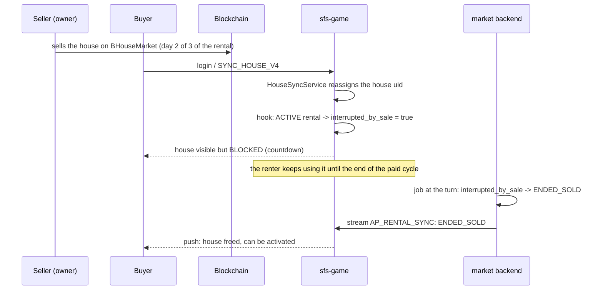

# House Rental (P2P) through the Market Site — Idea and Design Document

> Status: **implemented** — database, `/rental` routes and the charge job in `bombcrypto-market-v2/backend`; gameplay integration in sfs-game (`AP_RENTAL_SYNC` stream, rented house usable, activation blocked); `Rentals` and `My Rentals` pages on the site with wallet-signature login.
> Scope: listing, browsing and renting all happen on the **marketplace site** (`bombcrypto-market-v2`); the gameplay effects stay in the game. Payment is 100% in-game, using the **balance deposited in the game** (BCOIN or SEN) — no blockchain transaction at all.

## 1. Summary

Let a player who owns houses put them up for rent **through the marketplace site**, setting a **price per day in BCOIN or SEN**. Another player opens the site, browses the available houses (with rarity filters and sorting), picks **how many days** they want, and uses the house inside the game as if it were theirs for that period. The charge is **daily and always upfront**: day 1 is charged at rental time; at every 24h cycle turn the next day is charged. If the renter runs out of balance the rental ends and the house goes back to being available. The owner tracks on the site how much each house has earned and the total — and may have several houses listed at once.

Example: a house listed at 50 BCOIN/day. The renter picks 3 days → the site shows "Total: 150 BCOIN (50 BCOIN/day)". 50 is charged right away; 50 more after 24h; the last 50 after 48h. If at some turn there is no balance, the contract ends immediately and the house returns to the list.

The house is still an NFT the owner can **sell on the blockchain at any time** (the on-chain marketplace uses no escrow — the NFT stays in the seller's wallet). If the house is sold during a rental, the buyer receives it **blocked until the end of the day already paid**; at the day turn the rental is interrupted (instead of charging the next day) and the new owner can activate it in the game.

## 2. The central question: "can it be paid with deposited currency from the site?"

**Yes.** The deposited balance is not an on-chain asset — it is a row in the game database (table `user_block_reward`), mutated by the atomic functions `fn_sub_user_reward`/`fn_add_user_reward`. Any **trusted backend with access to the game database** can debit/credit — and this already happens today: `ap-market` (`bombcrypto-server-v2/api/market`), which runs the internal item market, is a Node/Express service that connects straight to the `bombcrypto2` database through `pg.Pool` and calls `sp_buy_item_market_v3` (which credits the seller and debits the buyer in a single transaction). Renting through the site uses the same pattern, with the market backend gaining a pool to the game database.

What **cannot** be done is doing this with what `bombcrypto-market-v2` has today:

| Gap in the current market-v2 | Evidence | Solution |
|---|---|---|
| Backend **without user authentication** — only an admin `X-API-Key` and per-IP rate limiting; the frontend connects the wallet only to sign on-chain transactions | `backend/src/api/middleware/auth.ts`, `frontend/src/context/smc.tsx` | Signature login reusing **ap-login** (§7) |
| Backend **without access to the game database** — only its own Postgres (`bsc`/`polygon` schemas of `house_orders`) | `backend/src/repositories/*` | Extra pool for `bombcrypto2` + `backend`, used only by the rental module (§6) |
| sfs-game **does not notice** changes made by external services — the online user state lives in memory in the JVM | ap-market talks only over synchronous HTTP + polling of the `MARKET:MIN_PRICE` Redis key | New Redis stream `AP_RENTAL_SYNC`, following the `AP_BL_SYNC_*` pattern (§11) |

## 3. Context — what already exists in the code

| Existing piece | Where | Why it matters |
|---|---|---|
| System "rent house" (packages by rarity/days, prepaid, `end_time_rent`) | `UserRentHouseHandler.kt`, `UserHouseManager.rentHouse()`, `config_package_rent_house_v2` | Rental precedent: deposited-balance debit + expiry by date. **Not P2P** — the money goes "to the system", restricted to airdrop networks. Will not be touched. |
| In-game balance | Table `user_block_reward` (`BCOIN`/`BCOIN_DEPOSITED`, `SENSPARK`/`SENSPARK_DEPOSITED`, keyed by network in the `type` column), functions `fn_sub_user_reward` / `fn_add_user_reward` (with `SELECT ... FOR UPDATE` + audit log in `logs.user_block_reward`) | It is the "account" the rental debits/credits, already atomic and audited. |
| P2P payment template | `sp_buy_item_market_v3` (debits buyer, credits seller with a fee, all in one transaction) | The exact transactional mould for the rental charge. |
| Web service touching the game balance | `ap-market` (`api/market`): Express + `pg.Pool` on the `bombcrypto2` database, procedures, `Scheduler.ts` with `delayUntilMidnight()` | Proof that the proposed architecture already runs in production; `Scheduler.ts` is the mould for the charge job. |
| Web login by wallet signature | `ap-login` (`api/login`): `POST /web/<bsc\|pol>/nonce` + `POST /web/<network>/check_proof` (validates `personal_sign` with `ethers.verifyMessage`) → 30 min HS256 JWT (payload `{address}`) + 30-day refresh | Site authentication essentially ready — the game's own web wrapper (`unity-web-template`) already uses this flow. |
| External service authenticating a player over HTTP | `POST /web/verify_login` (Bearer JWT → wallet), consumed by the `share-on-x` service (`ApLoginAuthVerifier.ts`) | The exact pattern the market backend uses to validate the player's token. |
| Wallet ↔ account link | `backend.bomberland.users`: **`UNIQUE(address)`** — 1 wallet = 1 account; the uid is `users.id`, replicated in the game database (`public."user".id_user`). BSC and POLYGON share the same uid; the network is the `type` column of the tables | Resolving "who is this player" from the connected wallet is deterministic. |
| House ownership in the game | Table `user_house` (PK `house_id`+`type`, owner = `uid` column); **pull** sync: `SYNC_HOUSE_V4` → blockchain API → Redis stream `AP_BL_SYNC_HOUSE` → `HouseSyncService` (diff inserts/deletes; `ON CONFLICT ... DO UPDATE SET uid` changes the owner) | There is no `Transfer`/`Sold` event indexer: the game only notices a sale when someone syncs. The "sold during a rental" rule needs its own check. |
| On-chain owner check | `blockchain-center-api` (`/callContract` → `ownerOf`) and `GET /house_owner` in the game's blockchain API | The market backend checks the real house owner on demand (it already uses `callContract` in the burn endpoint). |
| Gameplay effect of a house | Only 1 active house per user/network (`ACTIVE_HOUSE_V2`); heroes resting in it recover `recovery`/min instead of 0.5/min; `capacity` limits the slots | Defines what the renter "gets" out of renting. |
| Listing UI on the site | `frontend/src/views/market-bhouse.tsx`: rarity filters (checkboxes), BCOIN/SEN token, price range, sort, pagination, 5s auto-refresh; API with RHS filters (`house.handler.ts`) | Components and query format ready for the rentals page. |

## 4. Business rules

### Listing (owner side, on the site)
- **BR-01** — The owner of a house may list it for rent on the site by giving a **price per day** and a **token** (BCOIN or SEN). Each house has its own listing; the owner may have several houses listed at the same time.
- **BR-02** — A house can only have **one live listing** at a time. The owner may edit the price or remove the listing while it is **not rented** (editing the price does not affect running contracts).
- **BR-03** — While **rented**, the house **does not appear** in the available list and can neither be unlisted nor have its price changed until the contract ends.
- **BR-04** — When the house is rented the owner **loses the use of it in the game** for the duration of the contract: if it was the owner's active house it is deactivated and the heroes inside it go to SLEEP (same behaviour as the sync when a house is sold).
- **BR-05** — The owner gets an **earnings** view on the site: total received per house and overall, with the history of the daily payments.

### Renting (renter side, on the site)
- **BR-06** — The rentals page lists only houses whose listing is **available** (not rented), with **rarity and token filters** and **sorting** (price ↑/↓, rarity, most recent).
- **BR-07** — When renting, the renter picks the **number of days** (proposed limits: min. 1, max. 30). The site shows the **total** and makes it clear the charge is **daily** ("Total: 150 BCOIN — charged 50 BCOIN/day, always upfront").
- **BR-08** — The charge is **always upfront, one day at a time**: day 1 is charged when the rental is closed; each following day is charged at the 24h cycle turn (counted from the start of the contract).
- **BR-09** — If at the cycle turn the renter **does not have enough balance** in the contract token, the rental **ends immediately**: their heroes in the house go to SLEEP, they lose the use of it and the house goes back to the available list. There is no retroactive charge and no debt.
- **BR-10** — The payment comes out of the renter's **in-game balance** (deposited first, then mined — the same pattern as every other spending in the game) and is **credited to the owner** at the same instant, in the same transaction.
- **BR-11** — During the contract the rented house behaves **inside the game** for the renter like one of their own: it can be **activated** (respecting the 1-active rule) and it houses heroes with its own `recovery`/`capacity`.
- **BR-12** — The renter cannot rent their own house; and may only have **1 active contract at a time** (MVP simplification — see Open questions).
- **BR-13** — Once all contracted days are completed the rental ends normally: the renter's heroes go to SLEEP and the listing **goes back to available automatically** (the owner does not have to relist).

### On-chain sale while listed/rented
- **BR-14** — Listing for rent **does not prevent** the on-chain sale (the NFT stays in the owner's wallet). If a house that is **only listed** (no active contract) changes owner, the listing is **cancelled automatically** as soon as the system notices the change.
- **BR-15** — If a **rented** house is sold on-chain: the day already paid is **honoured** — the renter keeps using the house until the end of the current cycle; for the **buyer** the house is **blocked** (cannot be activated in the game) until the day turns. At the turn, instead of charging the next day, the contract is **interrupted** (`ENDED_SOLD`), the listing is cancelled and the new owner can activate the house.
- **BR-16** — The payment for the current day **stays with the previous owner** (who received it upfront). There is no pass-through and no refund.

### Account prerequisites
- **BR-17** — To **list**, the house must be synced in the game (`user_house.uid` = owner) — that is, the owner must have logged into the game at least once after acquiring the house (see open decision #9).
- **BR-18** — To **rent**, the renter must have a game account with a deposited balance in the chosen token — without it there is nothing to debit. The site shows the current balance and tells the player to deposit in the game when it is not enough.

## 5. User experience (site)

### 5.1 Player login on the site — just the wallet, no username/password

**There is no sign-up and no password.** The "login" is: connect the wallet (as the market already does today) + **sign a message** (`personal_sign` — 1 click, no gas cost, off-chain). The signature is what proves to the backend that the visitor really controls that wallet — merely "connecting" proves nothing, since the connected address is a claim from the browser that anyone can forge. The current market never needed this because sales are on-chain transactions (the blockchain validates the transaction's own signature) and the searches are public; the rental does need it, because the backend is going to debit the game balance of an account.

User flow: on the first action that touches the account (list, rent, view balance) the signature popup shows up; the site exchanges the signature for a session token (30 min JWT, renewed automatically for up to 30 days — it does not ask for a signature all the time). The game account **is** the wallet (1 wallet = 1 account, created automatically on first login). It is the same flow the player already goes through without noticing when entering the game through the web version.

### 5.2 **Rentals** page (browse and rent)

A new section next to Heroes/Houses on the site, with the same filter components as the house market:

```
┌────────────────────────────────────────────────────────────────┐
│  HOUSE RENTALS                        Balance: 🪙320  💎80      │
│  Rarity: ☐Tiny ☐Mini ☐Luxury ☐Pent ☐Villa ☐Super              │
│  Token: ☐BCOIN ☐SEN   Price/day: [min]–[max]                   │
│  Sort by: [Lowest price ▾]           Network: [BSC ▾]          │
│  ┌──────────────────────────────────────────────────┐          │
│  │ 🏠 Villa (R4)   ⚡2.0/min   👥6 slots             │          │
│  │    50 BCOIN/day                       [Rent]     │          │
│  ├──────────────────────────────────────────────────┤          │
│  │ 🏠 Luxury (R2)  ⚡1.2/min   👥4 slots             │          │
│  │    30 SEN/day                         [Rent]     │          │
│  └──────────────────────────────────────────────────┘          │
│                      [ page 1 2 3 … ]                          │
└────────────────────────────────────────────────────────────────┘
```

Confirmation modal after clicking **Rent**:

```
┌───────────────────────────────────────┐
│  Rent Villa (R4)                      │
│  Days:  [−]   3   [+]      (1 to 30)  │
│                                       │
│  Period total:      150 BCOIN         │
│  Charge:  50 BCOIN/day, upfront       │
│  Your deposited balance: 320 BCOIN    │
│  ⚠ Day 1 is charged now. The others   │
│  are charged every 24h. With no       │
│  balance at the turn, the rental ends.│
│                                       │
│        [Cancel]      [Confirm]        │
└───────────────────────────────────────┘
```

### 5.3 **My Rentals** page (logged in)

**"My listings" tab** (owner):

```
│ Total rental earnings:  🪙 1,250 BCOIN  💎 200 SEN    │
│ 🏠 Villa (R4)   RENTED — day 2/3                      │
│    50 BCOIN/day  earned: 450       [statement]        │
│ 🏠 Mini (R1)    AVAILABLE                             │
│    10 SEN/day    earned: 200       [✎ price] [Remove] │
│ 🏠 Tiny (R0)    NOT LISTED         [List]             │
```

**"My rental" tab** (renter):

```
│ 🏠 Villa (R4) — day 2 of 3                            │
│ Next charge in 07:41:12 · 50 BCOIN/day                │
│ Already paid: 100 BCOIN                               │
│ ⚠ Keep 50 BCOIN of deposited balance so you do not    │
│   lose the rental at the turn.                        │
```

### 5.4 What shows up inside the game — and how much has to change in the Unity client

The game **gets no rental marketplace screen**, and **nobody has to log in again** to see changes: the events from the `AP_RENTAL_SYNC` stream become pushes the client **already understands today** — `SYNC_HOUSE_RESPONSE` (the `ServerNotifyManager` already handles it and reloads the house list) and the balance push in the `SYNC_DEPOSIT_RESPONSE` shape (the balance UI already reacts on its own). Rent on the site with the game open → the house shows up in the list within seconds, just like an on-chain deposit arriving while the player is online.

There are two levels of client integration, and the MVP can be the first one:

**Level 0 — zero client changes.** sfs-game "disguises" the rented house as a normal house of the renter in the existing sync payloads: it enters the list, is activated by the usual `ACTIVE_HOUSE_V2` and heroes rest in it (the recovery effect is 100% server-side). At the end of the contract it disappears from the list on the next push (like a sold house). UX trade-offs:
- Owner: the rented house disappears from the list (looks sold) or stays and activating returns a generic error — no "rented" badge.
- Buyer of a rented house: activating returns a generic error, with no lock/countdown.
- No charge/income popups — the balance updates silently.

**Level 1 — small polish on the client (final phase).** Extra fields in the responses that already exist + light UI:
- **Renter**: house marked "rented until HH:MM" (the `HouseData` model already has `EndTimeRent`, from the self-rent).
- **Owner**: house marked "listed on the market" / "rented — day X/Y", without being able to use it.
- **Buyer**: lock + countdown "available in HH:MM:SS" (reusing the `Locked` state pattern of house items).
- **Notifications**: a message of its own for the `HOUSE_RENTED` error and toasts at the turn ("charged" / "rental ended" / "you received 50 BCOIN from the rental").

None of this looks like the cost of a marketplace panel inside the game — it is state display, not a new flow.

Nature of the Level 1 changes (important for estimating):
- **C# code only** (without opening the Unity Editor): message for the `HOUSE_RENTED` error (new case in the error handling + localization), parsing of the extra sync fields (in the existing `*Declaration.cs`), countdown logic (`HouseData` already has `EndTimeRent`).
- **Prefab in the Unity Editor** (a "rented" badge/lock in the house list item): **not new design** — `HouseListItemAirdrop` already implements the `Rent`/`Locked` states with a "Rent end in HH:MM:SS" countdown in airdrop mode; the work is replicating that treatment in the BNB/POL house item. No new screen, panel or asset. These prefab edits can be done through Unity MCP (the same flow used for the farm averages panel).

## 6. Architecture

> **Implemented**: everything lives **inside the market backend** (`bombcrypto-market-v2/backend`), as a new module (`/rental`) — there is no separate service. The market backend gained an additional connection to the game database (`bombcrypto2`) and to the account database (`backend`), used exclusively by the rental. If `RENTAL_GAME_CONN_STR` is empty the feature is simply not mounted and the market keeps working as before.



Split of responsibilities:

| Responsibility | Where it lives |
|---|---|
| List / unlist / browse / rent / earnings statement | **Market backend** (`/rental` routes) + market frontend |
| Daily upfront charge + terminations | **Market backend** (`node-cron` job, every 5 min by default) |
| Balance debit/credit | Procedures in the game database (§8), called by the market backend |
| Gameplay effects (heroes sleeping, blocking activation, the renter's house) | **sfs-game**, reacting to the `AP_RENTAL_SYNC` stream + loading state from the database at login |
| On-chain owner check (anti-fraud) | Market backend → `blockchain-center-api` (`ownerOf`, reusing the `callContract` the market already uses in the burn endpoint) |

Why inside the market and not in a new service: the site is already served by this backend, it already talks to `blockchain-center-api` and it already has rate limiting, helmet and CORS configured. The cost is giving it access to the game database — mitigated by being a separate pool, optional (the feature turns itself off without the env var), and with every balance movement going through the procedures with `FOR UPDATE` and an audit log.

## 7. Authentication on the site

Flow (100% existing ap-login infrastructure):

1. The user connects the wallet on the site (Web3Modal, already in market-v2).
2. The site calls `POST /web/<bsc|pol>/nonce` → receives the challenge; builds the `"Your login code: ..."` message (same logic as `unity-web-template/src/controllers/WalletService.ts`) and asks for `personal_sign`.
3. `POST /web/<network>/check_proof` → receives `{auth: 30min JWT, rf: 30-day refresh}`. The site stores it and renews through `GET /web/<network>/refresh/:rf`.
4. Every call to the `/rental` routes carries `Authorization: Bearer <JWT>`. The backend validates it by forwarding to `POST /web/verify_login` (the pattern already used by share-on-x) and gets the **wallet** back; it resolves the **uid** with a SELECT on the `bomberland.users` table (`address` is UNIQUE) — a read-only connection to the account database.

Notes:
- Signing the login message **costs no gas** and does not touch the blockchain.
- A player who never entered the game: the web login does create the account (`fn_select_or_insert_new_user_web`), but listing requires a synced house (BR-17) and renting requires a deposited balance (BR-18).

## 8. Data model (new tables in the game database)

Nothing changes in `user_house` (the existing `end_time_rent` belongs to the system self-rent and stays untouched).

```sql
-- The owner's offer (one "live" row per house)
CREATE TABLE public.house_rental_listing (
    id            bigserial PRIMARY KEY,
    house_id      integer      NOT NULL,
    type          varchar(20)  NOT NULL,           -- network (BSC/POLYGON), same as user_house.type
    owner_uid     integer      NOT NULL,
    price_per_day double precision NOT NULL CHECK (price_per_day > 0),
    pay_token     varchar(20)  NOT NULL,           -- 'BCOIN' | 'SEN'
    status        varchar(16)  NOT NULL,           -- AVAILABLE | RENTED | CANCELLED
    created_at    timestamptz  DEFAULT now(),
    updated_at    timestamptz  DEFAULT now()
);
-- guarantees 1 live listing per house
CREATE UNIQUE INDEX ux_rental_listing_live
    ON public.house_rental_listing (house_id, type)
    WHERE status IN ('AVAILABLE', 'RENTED');
CREATE INDEX ix_rental_listing_browse
    ON public.house_rental_listing (type, status, pay_token, price_per_day)
    WHERE status = 'AVAILABLE';

-- Rental contract (active and history)
CREATE TABLE public.house_rental (
    id                 bigserial PRIMARY KEY,
    listing_id         bigint      NOT NULL REFERENCES public.house_rental_listing(id),
    house_id           integer     NOT NULL,
    type               varchar(20) NOT NULL,
    owner_uid          integer     NOT NULL,       -- owner at contract time
    renter_uid         integer     NOT NULL,
    price_per_day      double precision NOT NULL,  -- frozen in the contract
    pay_token          varchar(20) NOT NULL,
    total_days         integer     NOT NULL,
    days_paid          integer     NOT NULL DEFAULT 0,
    started_at         timestamptz NOT NULL,
    current_period_end timestamptz NOT NULL,       -- end of the day already paid = next turn
    interrupted_by_sale boolean    NOT NULL DEFAULT false, -- house sold on-chain: stop charging
    status             varchar(20) NOT NULL,       -- ACTIVE | ENDED_COMPLETED | ENDED_NO_FUNDS
                                                   -- | ENDED_SOLD | ENDED_BY_RENTER
    ended_at           timestamptz
);
CREATE UNIQUE INDEX ux_rental_active_house  ON public.house_rental (house_id, type) WHERE status = 'ACTIVE';
CREATE UNIQUE INDEX ux_rental_active_renter ON public.house_rental (renter_uid, type) WHERE status = 'ACTIVE';
CREATE INDEX ix_rental_charge ON public.house_rental (current_period_end) WHERE status = 'ACTIVE';

-- Statement of the daily payments (source of the owner's earnings screen)
CREATE TABLE public.house_rental_payment (
    id          bigserial PRIMARY KEY,
    rental_id   bigint      NOT NULL REFERENCES public.house_rental(id),
    day_number  integer     NOT NULL,              -- 1..total_days
    amount      double precision NOT NULL,
    pay_token   varchar(20) NOT NULL,
    owner_uid   integer     NOT NULL,
    renter_uid  integer     NOT NULL,
    charged_at  timestamptz NOT NULL DEFAULT now()
);
CREATE INDEX ix_rental_payment_owner ON public.house_rental_payment (owner_uid, pay_token);
```

Plus two procedures following the `sp_buy_item_market_v3` pattern (debit + credit + contract write in a single transaction):

- **`sp_rent_house_p2p(listing_id, renter_uid, num_days)`** — locks the listing with `FOR UPDATE`; validates `status = 'AVAILABLE'`, `renter ≠ owner`, and that `user_house.uid` is still the `owner_uid` (if it changed, cancels the listing and fails); charges day 1 (`fn_sub_user_reward` 6-arg: `*_DEPOSITED` first, the rest from the mined balance); credits the owner (`fn_add_user_reward`, discounting the fee if any); creates `house_rental` (days_paid=1, `current_period_end = now() + interval '1 day'`), marks the listing `RENTED` and inserts the day 1 payment. Before calling it, the backend checks the owner **on-chain** through `ownerOf` (§12).
- **`sp_charge_house_rent_day(rental_id)`** — locks the contract with `FOR UPDATE`; charges +1 day from the renter and credits the owner; `days_paid++`, `current_period_end += 1 day`, inserts the payment. If `fn_sub_user_reward` raises `1019, Not enough` the procedure returns the failure code so the caller ends the contract.

The debit/credit is already logged in `logs.user_block_reward` with its own `reason` (e.g. `'House rental payment'` / `'House rental income'`), but the earnings screen reads from `house_rental_payment` (a simple query, without scanning log partitions).

## 9. REST API (mounted at `/rental` in the market backend)

All authenticated with a Bearer JWT (uid from the token), except the public browsing. Network through the `network` parameter (`bsc`|`polygon`).

| Method/route | Description |
|---|---|
| `GET /rental/listings` | Public. Filters `rarity[]`, `pay_token`, sorting `order_by=asc:price_per_day` etc., pagination — the same RHS format as the market-v2 backend, so the frontend reuses components |
| `POST /rental/listings` | Owner lists: `{house_id, network, price_per_day, pay_token}`. Validates `user_house.uid = uid from the token` **and** `ownerOf` on-chain |
| `PATCH /rental/listings/:id` / `DELETE` | Edit the price / unlist (only without an active contract) |
| `POST /rental/rent` | Renter rents: `{listing_id, num_days}` → checks the on-chain owner → `sp_rent_house_p2p` (charges day 1) → `XADD AP_RENTAL_SYNC` |
| `GET /rental/me/listings` | My listings + earnings (aggregate of `house_rental_payment`) |
| `GET /rental/me/rental` | My active contract (days paid, next charge) |
| `GET /rental/me/balance` | Deposited BCOIN/SEN balance (read from `user_block_reward`) for the site to show before confirming |

## 10. Flows

### 10.1 Daily charge (`node-cron` job in the market backend)

A job every **5 minutes** (`node-cron`, expression configurable in `RENTAL_CHARGE_CRON`) — the cycle is 24h from the start of each contract, so the turn happens at varying times, not at midnight:



Details:
- `FOR UPDATE SKIP LOCKED` protects against the job running on more than one instance.
- Every termination and every charge becomes an event on the `AP_RENTAL_SYNC` stream; sfs-game applies the gameplay effects (heroes to SLEEP etc.) and notifies whoever is online (§11).
- **Lazy backup check in the game**: at the renter's login and when using the house, if `current_period_end <= now` and the job has not processed it yet, the server handles the turn right there (querying the database, which is the source of truth).
- The `ownerOf` query (1 call per rented house per day, at the turn) covers the case of a sale with **both users offline**, where no house sync would run.

### 10.2 On-chain sale during the rental

Three detection triggers (there is no indexer for house Transfer events):

1. **When listing and when renting** — the backend checks `ownerOf` on-chain; if it does not match the registered owner it cancels the listing and refuses.
2. **A sync by either party in the game** — a new hook in `HouseSyncService`: when reassigning the `uid` of a house (`insertNewHouse ON CONFLICT`) or removing it from the seller, it looks up a live listing/contract for that `house_id`: `AVAILABLE` listing → `CANCELLED` right away; `ACTIVE` contract → marks `interrupted_by_sale = true` (the paid day is honoured; it does **not** end right away).
3. **Day turn** — the job checks `ownerOf` before charging (flow above).

While the contract is `ACTIVE` the **new owner cannot activate** the house in the game: `ActiveHouseV2Handler` gains the check "is there an ACTIVE rental of this house for another uid?" → new `HOUSE_RENTED` error; in the game it shows up locked with a countdown to `current_period_end`.



### 10.3 Possible terminations

| Final status | Trigger | Does the house go back to the list? |
|---|---|---|
| `ENDED_COMPLETED` | completed `total_days` | Yes (automatically `AVAILABLE`) |
| `ENDED_NO_FUNDS` | no balance at the turn | Yes |
| `ENDED_SOLD` | sold on-chain, at the next turn | No (`CANCELLED` — the owner changed) |
| `ENDED_BY_RENTER` | the renter gives up (15% penalty over the remainder: 10% owner + 5% game) | Yes |

## 11. Integration with sfs-game

The gameplay effects stay in the game server:

- **Renter**: `UserHouseManager` also loads the rented house (today `loadUserHouse` filters `WHERE uid = ?`; the rented house comes in through a join with `house_rental ACTIVE`); it can be activated (`ACTIVE_HOUSE_V2`); heroes rest in it. The `user_hero_house_rent` table already shows heroes tied to a `house_id` without a `uid` — a precedent for a renter's heroes in someone else's house.
- **Owner**: when it gets rented, if it was their active house, it is deactivated and the heroes go to SLEEP.
- **Buyer of a rented house**: `ActiveHouseV2Handler` refuses activation with `HOUSE_RENTED` until the contract ends.
- **`HouseSyncService`**: owner-change hook (§10.2).

The notification channel is the **Redis stream `AP_RENTAL_SYNC`**, published by the market backend and consumed by the Kotlin side following exactly the `AP_BL_SYNC_*` pattern (listener registered in `ServerInitializerBnbPol`, handling in the `BlockchainResponseManager` style):

```json
{ "event": "LISTED|UNLISTED|RENTED|CHARGED|ENDED_COMPLETED|ENDED_NO_FUNDS|ENDED_SOLD",
  "rental_id": 123, "house_id": 456, "type": "BSC",
  "owner_uid": 1, "renter_uid": 2 }
```

On consumption, for each involved user who is **online**: it reloads the in-memory balance (`blockRewardManager.loadUserBlockReward()`), updates the house state (adds/removes the rented house, puts heroes to SLEEP when the contract ends) and sends an encrypted push (`HOUSE_RENTAL_UPDATE_RESPONSE` + a `rewards` array, the same pattern as the `SYNC_DEPOSIT_RESPONSE` deposit push). **Offline** user: nothing to do — the login loads everything from the database, which is the source of truth.

**Balance consistency between site and game**: the real debit is always `fn_sub_user_reward` with `FOR UPDATE` in the database — the game's in-memory cache is only a pre-check, and the mining saves are **deltas** (`fn_add_user_reward`), never absolute overwrites. There is no possible double-spend between site and game; the worst case without the push would be the player seeing a stale balance until the next event that reloads it — with the push, not even that. (It is the same problem already solved for on-chain deposits arriving while the player is online.)

## 12. Security and anti-fraud

Premise: the API is **public on the internet** and the browser is hostile. The uid always comes **from the token, never from the body**; the database is the last line of defence.

- **Listing someone else's house**: impossible by construction — `POST /rental/listings` validates `user_house.uid = uid from the token` **and** `ownerOf` on-chain in the same operation.
- **Renting an unlisted house**: impossible by construction — `POST /rental/rent` references a `listing_id`; the only path to a rental is through a listing created by the owner. The procedure locks the listing with `FOR UPDATE` and requires `status = 'AVAILABLE'`.
- **Two renters racing for the same house**: `FOR UPDATE` on the listing + partial unique indexes (`ux_rental_active_house`, `ux_rental_active_renter`) guarantee at most 1 active contract per house and per renter, even with concurrent requests.
- **Stale-ownership scam**: since the game's owner sync is pull-based, a player could **sell the house on-chain and list it / keep it listed** while `user_house` still points to them as the owner. Layered mitigation: (1) `ownerOf` on-chain **when listing and when renting**; (2) `ownerOf` **at each day turn** before charging — a maximum loss of one daily fee; (3) the `HouseSyncService` hook cancels listings / marks `interrupted_by_sale` as soon as the game notices the change.
- **Malicious payloads**: `num_days` outside 1–30, `price_per_day <= 0`, invalid tokens/networks → rejected in the handler and reinforced by `CHECK` constraints in the schema and validation in the procedure (never trust the API alone).
- **Balance**: debit and credit only through `fn_sub_user_reward`/`fn_add_user_reward` (with `SELECT ... FOR UPDATE` and an audit log) — no charging path outside the procedures, no possible "debt" (missing balance = `1019` exception = the contract ends).
- **Pretending to be another wallet**: impossible without its private key. The token is only issued by `check_proof` after signing a single-use nonce (5 min TTL, deleted from Redis after any attempt); `ethers.verifyMessage` **recovers the signer's address** from the cryptography itself — it is not a declared field. A tampered JWT fails the HS256 verification (`JWT_LOGIN_SECRET` only exists on the server); an old signature is not reusable (single-use nonce). And even with a valid token of one's own wallet, listing someone else's house runs into the `user_house.uid` + `ownerOf` checks.
- **Residual risks (standard web, not specific to the rental)**: token theft through XSS/malware (mitigated by the 30 min expiry, HTTPS, restricted CORS and safe storage on the front end), a compromised private key (the attacker "is" the wallet — a risk identical to the current on-chain market) and a leak of `JWT_LOGIN_SECRET` (operational secret protection, same as the game's own login).
- **Authentication**: 30 min JWT validated at ap-login (`verify_login`); single-use login nonce with a 5 min TTL (anti-replay, already implemented in ap-login).
- **Public API hardening**: CORS restricted to the site domain, rate limiting per wallet (share-on-x pattern) and per IP (market-v2 pattern), a neutral response for an invalid token, HTTPS required.

## 13. Edge cases

- **Renter with balance for day 1 only**: allowed — that is the nature of the daily charge. The contract dies at the first turn without balance (BR-09).
- **Owner edits the price with an active contract**: blocked (BR-03); the contract freezes `price_per_day`.
- **Owner tries to unlist a rented house**: blocked until the contract ends; "not renewing" is automatic, since the contract has a fixed `total_days`.
- **The house was the owner's active one when it got rented**: it is deactivated and the owner's heroes go to SLEEP right away (BR-04); the owner finds out through the push (if online) or at the next login.
- **The renter already had another active house**: activating the rented one follows the normal active-house switch rule (excess heroes go to SLEEP if the capacity is smaller).
- **Rental closed on the site while the renter is playing**: the `RENTED` event on the stream makes the server load the house and update the in-memory balance right away — no need to log in again.
- **Backend down at the turn**: the job charges late when it comes back; the following turn counts from `current_period_end` (not from `now()`), so the renter does not lose paid time.
- **Job running concurrently on more than one instance**: `FOR UPDATE SKIP LOCKED` + partial uniqueness prevent double charging; debit/credit are atomic SQL functions. (MVP: a single instance, like ap-market.)
- **Owner renting to himself with a secondary account**: no economic impact (money moves between his own accounts, with the fee if any); no special rule in the MVP.
- **Networks**: the MVP covers BSC/POLYGON (where house NFTs and deposited BCOIN/SEN balances exist; the site already operates both). The uid is the same on both networks; balance and listing are per network (`type`). Airdrop networks (TON/SOL/RON/...) are out of scope.

## 14. Open questions (to decide before implementing)

1. ~~Platform fee~~ — resolved: **5%** per daily payment (`house_rental_fee` in `game_config`). By default it leaves circulation (sink); setting `house_rental_fee_uid` with an account uid credits the amount to it. The amount of each fee is recorded in `house_rental_payment.fee`.
2. **Price and day limits**: minimum/maximum `price_per_day` (to avoid a listing at 0.000001) and a day cap (1–30 proposed).
3. ~~Early cancellation~~ — implemented: the renter may give up at any time; the contract ends **right away** (the day already paid is not refunded) and they pay a penalty of **15% over the amount still owed** — 10% to the owner and 5% to the game (`house_rental_cancel_fee_owner` / `house_rental_cancel_fee_game`). Without balance for the penalty the cancellation is refused and the rental continues.
4. **1 active contract per renter** (BR-12) — enough for the MVP, or should multiple simultaneous rentals be allowed right away? (Multiple ones complicate the 1-active-house rule and the UI.)
5. **Token of the owner's credit**: credit as `*_DEPOSITED` (the internal P2P market pattern, minimum claim of 1) — to be confirmed.
6. **Should the rented house be usable as "extra capacity"** (the self-rent pattern through `findHouseRest`) besides being activatable, or only as the active house? (MVP proposal: only activatable, simpler to reason about.)
7. ~~Domain/deploy~~ — resolved: the routes live in the same market backend/domain (`/rental`), with no new CORS.
8. **Unified login on the site**: take the opportunity to give market-v2 a player login as a whole (personal history etc.) or keep the JWT restricted to the rental routes?
9. **BR-17**: require the house to be synced in the game beforehand (simple) or have the backend upsert the house from the on-chain data when listing (friendlier for someone who never logged in)?

## 15. Suggested phases

1. **Phase 1 — Database** ✅ done: migrations for the `house_rental_*` tables and the `sp_rent_house_p2p`/`sp_charge_house_rent_day` procedures.
2. **Phase 2 — Market backend** ✅ done: `/rental` routes, auth through `verify_login`, `node-cron` charge job and the `AP_RENTAL_SYNC` stream. Testable with curl, without UI.
3. **Phase 3 — sfs-game** ✅ done: stream listener, loading the rented house in `UserHouseManager`, `HOUSE_RENTED` blocking in `ActiveHouseV2Handler`, hook in `HouseSyncService`, lazy check at login, pushes.
4. **Phase 4 — Site** ✅ done: signature login + Rentals/My Rentals pages in the market-v2 frontend.
5. **Phase 5 — Polish**: configurable fee, contract extension/renewal, multiple rentals per renter, a house `Transfer` indexer for real-time sale detection, richer state display inside the game.
